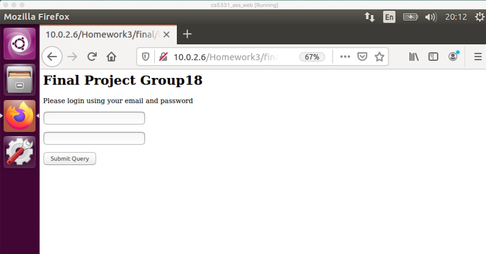
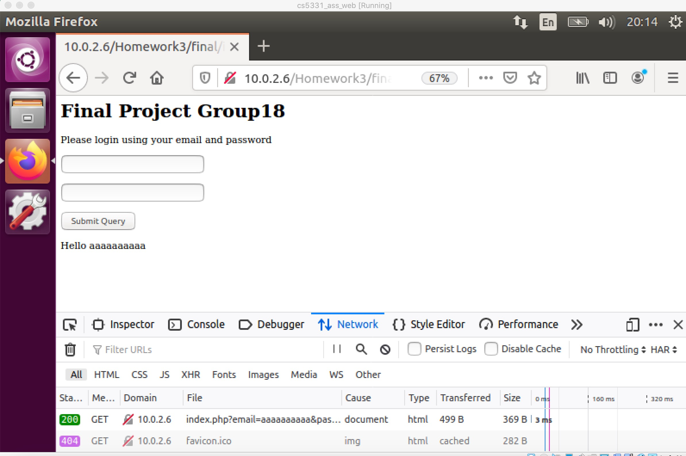
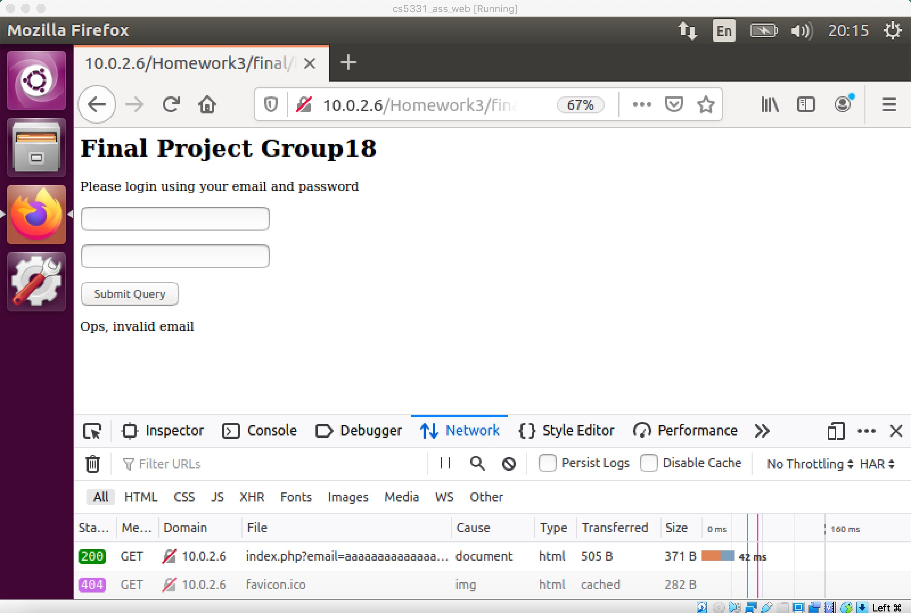

# Progress Report

## Problem definition

### Problem Background
A regular expression is a sequence of characters that define a search pattern. Usually such patterns are used by string searching algorithms for "find" or for input validation. The fact that most regular expression implementations have exponential time worst case complexity, so for larger input strings (the ‘evil regex’), the time taken by a regex engine to find a match increases exponentially. It can be exploited to make up the Regular expression Denial of Service (ReDoS). ReDoS is a Denial of Service attack. An attacker can cause a program using a Regular Expression to enter extreme situations and hang for a very long time.[1](#Reference)

### Project Goal
Analyze and understand the logic of ReDoS. Reproduce the attack and base on the attacks to evaluate and design defense measures.

### System Setup
- [X] Unix System: Reuse unix VM from CS5331 Homework3
- [X] Web Server: Reuse web server from CS5331 Homework3
- [X] Web Page: [Vulnerable Page](../vulnerable/README.md)
- [X] Web Browser: Firefox 31.0
- [X] Attack VM: Any unix system apart from the one running vulnerable web page
- [X] Concurrent Attack Script: [Multiple Scripts](../attack/README.md)

### Reference
1. [Understanding ReDoS Attack. (n.d.) Retrieved March 22, 2020](https://www.geeksforgeeks.org/understanding-redos-attack/)
2. [Regular expression Denial of Service - ReDoS](https://owasp.org/www-community/attacks/Regular_expression_Denial_of_Service_-_ReDoS/)

## Progress Update

### Reproduce
We are able to reproduce the problem in our environment. 
1. The `evil regex` query results in larger response time than normal response.
2. The CPU usage is reaching 100% while running concurrent request to the server.

### Solution
1. Restrict the length of string, and check the length before checking the regex
2. Avoid using `-/(something+)+$/` in regex checking

### Demo
[Attack Demo 1] Browser demo of `evil regex` increases response time 
[Attack Demo 2] Attack demo when CPU running time increases 
[Solution Demo 1] Attack demo when CPU is not as high as Vulnerable 

### Result
[Web Page] 
[Normal Request] 
[Attack Demo 1] 
[Attack Demo 2] 
[Solution Demo 1] TBD 